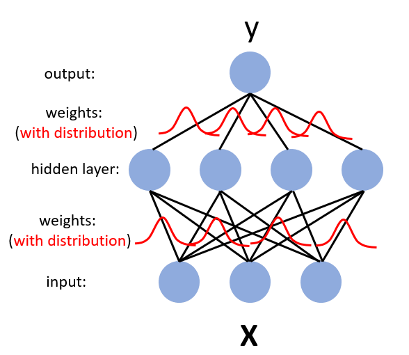

# Aprendizaje profundo bayesiano

El aprendizaje profundo bayesiano es una rama del [aprendizaje profundo](https://es.wikipedia.org/wiki/Aprendizaje_profundo) resultante de combinar [redes neuronales](https://es.wikipedia.org/wiki/Red_neuronal_artificial) con [estadística bayesiana](https://es.wikipedia.org/wiki/Estad%C3%ADstica_bayesiana).

## ¿Qué es?

El enfoque tradicional frecuentista asigna un valor (determinista) a los pesos de la red. En contraposición, el enfoque bayesiano los modela con una [distribución de probabilidad](https://es.wikipedia.org/wiki/Distribuci%C3%B3n_de_probabilidad).

_NOTA: esta distribucción de parámetros inicial junto con la selección de la arquitectura de red y los datos disponibles forman parte de nuestras hipótesis iniciales en el teorema de bayes._

## Aplicaciones

### Estimación de la fiabilidad del modelo
Si inspeccionamos los parámetros (probabilísticos), podemos determinar la confianza en los mismos. Por ejemplo, si convergen en un valor porque la varianza de la distribución es pequeña. Esto no quita que usemos métricas frecuentistas para determinar el rendimiento del modelo.

### [Estimación de la incertidumbre en las predicciones](uncertainty_estimation/README.md)
Se puede obtener una medida de la **incertidumbre** por cada predicción al ser dicha predicción una distribución de probabilidad sobre los posibles valores.

### Ejemplo
Tenemos un modelo que predice la temperatura en grados centígrados ºC:

#### Visión frecuentista
El modelo predice 5. Conocemos la predicción pero no cómo de fiable es.

#### Visión bayesiana
El modelo predice una [distribución normal](https://es.wikipedia.org/wiki/Distribuci%C3%B3n_normal) con media 5 y desviación típica de 0.5. El 68% de la probabilidad está entre 4.5 y 5.5 o que el 99,7% está entre 3.5 y 6.5. Es decir, seguro que hace frío ya que la variabilidad es poca.

El modelo predice una distribución normal con media 5ºC y desviación típica de 10.0.Tenemos una variabilidad de +-10ºC el 68% de las veces, es decir, entre -5ºC y 15ºC, la diferencia entre un día duro de invierno y uno agradable de primavera. El 99.7% de las veces, estaríamos en +-25%, una predicción bastante mala.

## Referencias
* [Deep learning](https://en.wikipedia.org/wiki/Deep_learning) - Wikipedia
* [Bayesian Deep Learning: Introduction](https://taeoh-kim.github.io/blog/bayesian1/) - Taeoh Kim
* [[Bayesian DL] 3. Introduction to Bayesian Deep Learning](https://medium.com/jun-devpblog/bayesian-dl-3-introduction-to-bayesian-deep-learning-af877845dde1) - Medium
* Deep Learning Is Not Good Enough, We Need Bayesian Deep Learning for Safe AI - Alex Kendal
  * [HTML](https://alexgkendall.com/computer_vision/bayesian_deep_learning_for_safe_ai/)
  * [PDF - Paper NIPS](https://papers.nips.cc/paper/7141-what-uncertainties-do-we-need-in-bayesian-deep-learning-for-computer-vision.pdf)
* [The Case for Bayesian Deep Learning](https://arxiv.org/abs/2001.10995) - arXiv
* [Marginalisation principle](http://users.ics.aalto.fi/harri/thesis/valpola_thesis/node16.html)

