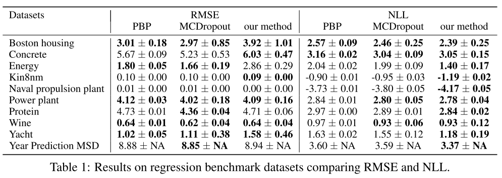
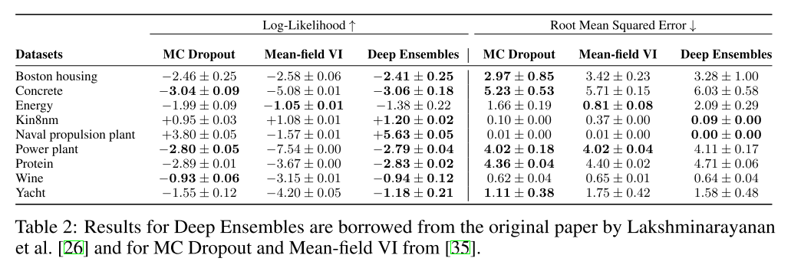

# Metodología de validación 

En los siguientes puntos se resume el conjunto de prácticas aplicadas para la correcta evaluación de los resultados obtenidos en los experimentos realizados y las razones por las que se han aplicado dichas prácticas.

* **Generación de datos sintéticos**: En la mayoría de los experimentos realizados se ha obtado por la generación de datos mediante distintas funciones de regresión y la addición de ruido de distinto tipo

    *¿Por qué es importante trabajar con datos sintéticos?*

    En la práctica es dificil encontrar datasets reales que cubran toda la variabilidad intrínseca de un problema. 

    Por ejemplo, si quisieramos evaluar la estimación de la incertidumbre en la problemática de vehículos autónomos, probablemente estaríamos interesados en un dataset de imágenes anotadas que cubra oclusiones, distintos niveles de profundidad y condiciones ambientales adversas. Sin embargo, la obtención de este tipo de datasets suele suponer un esfuerzo muy alto que en la mayoría de los casos las empresas privadas protegen cómo un activo más de valor de la misma.

    *Nota: En concreto, en esta problemática se pueden encontrar algunos datasets de referencia como Raincouver que incluye condiciones ambientales adversas pero tiene muy pocos ejemplos o Berkeley Deep Drive que aunque cuenta con 5683 imágenes anotadas se ha visto que hay inconsistencias en las etiquetas*

* **Selección de una medida común**: Es necesario establecer una medida de incertidumbre común que permita comparar e interpretar resultados. En esta línea se ha visto que la métrica más comunmente utilizada en la academia para problemas de regresión es **la varianza o RMSE** y en problemas **clasificación la más utilizada es la entropía o cross-entropy**

* **Métricas complementarias de validación**: En la validación de la incertidumbre se ha visto que además de las métricas RMSE o cross-entropy es necesario utilizar métodos de validación complementarios por las restricciones que estas dos anteriores imponen (e.g. RMSE asume que los datos siguen distribución gausiana):

    * **Regressión**:

        * [Negative Log-Likelihood](https://medium.com/deeplearningmadeeasy/negative-log-likelihood-6bd79b55d8b6)

    * **Clasificación**: 
        * [Classical Reliability Diagrams](https://towardsdatascience.com/introduction-to-reliability-diagrams-for-probability-calibration-ed785b3f5d44)

        * [Relative entropy (KL Divergence)](https://machinelearningmastery.com/cross-entropy-for-machine-learning/)

        * [Brier Score](https://statisticaloddsandends.wordpress.com/2019/12/29/what-is-a-brier-score/)

* **Utilizar un juego de datasets reales**: Además de los métodos expuestos anteriormente es importante tener un juego de datasets reales de distinta índole que permita evaluar y comparar  su utilidad en distintos escenarios. En este sentido se ha seleccionado el [dataset de precios de casas de Boston](https://scikit-learn.org/stable/modules/generated/sklearn.datasets.load_boston.html)  íncluido en la librería de scikit-learn y el dataset de [Kaggle M5 Forecasting Uncertainty](https://www.kaggle.com/c/m5-forecasting-uncertainty) de precios de producto propuesto por los supermercados Wallmart

* **Comparación con baselines o modelos de referencia**: En este punto destacan los siguientes modelos y benchmarks de referencia:

    * **Modelos de referencia**:
        * MonteCarlo Dropout
        * Variational Inference
        * (DeepEnsembles)[https://arxiv.org/abs/1912.02757]

    * **Benchmarks de referencia**:

***Referencia**: On the Importance of Strong Baselines in Bayesian Deep Learning*

***Referencia**: Lakshminarayanan, B., Pritzel, A., & Blundell, C. (2017). Simple and scalable predictive uncertainty estimation using deep ensembles. Advances in Neural Information Processing Systems, 2017-Decem(Nips), 6403–6414*

***Referencia**: Filos, A., Farquhar, S., Gomez, A. N., Rudner, T. G. J., Kenton, Z., Smith, L., … Gal, Y. (2019). A Systematic Comparison of Bayesian Deep Learning Robustness in Diabetic Retinopathy Tasks. (NeurIPS), 1–12. Retrieved from http://arxiv.org/abs/1912.10481*

